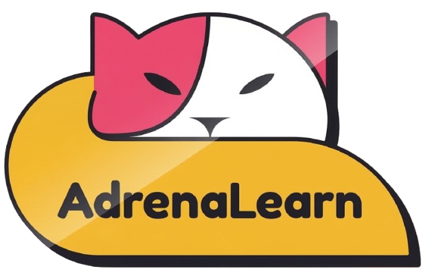

<div align="center">
  
  <p><b>Where realm of education joins hands with the peak of adrenaline</b></p>
  <p>An innovative, gamified e-learning platform that transforms programming education into an engaging adventure.</p>
</div>

---

## 🚀 The Problem & Our Solution
Learning to anything can be tedious and intimidating. **AdrenaLearn** make Academics engaging, and fun by seamlessly blending interactive lessons, AI-powered tutoring, and actual gameplay. Students master core concepts through play, competition, and real-time feedback.

## ✨ Key Features
- **📄 PDF to Custom Game Arena:** Turn any educational PDF into personalized, interactive game-based learning experiences with AI-generated challenges in seconds.
- **🤖 Built-in AI Tutor (Gemini):** Real-time, context-specific help and debugging assistance using Google Generative AI.
- **📝 In-Browser Coding:** Integrated Monaco code editor with instant test case validation.
- **🏆 Global Leaderboards:** Compete with friends and the global community in real-time.

## 🕹️ The Games
AdrenaLearn features three core games, each designed to teach specific programming skills:
1. **🔴 Space Academia:** Write logic to find the "imposter". Teaches conditional logic, boolean operators, and problem-solving.
2. **🧙‍♀️ Kat Mage:** Solve coding puzzles to progress the narrative. Teaches functions, arrays, and loops.
3. **🎈 Precision Pop:** Fast-paced arcade action. Hitting balloons correctly executes code. Teaches pattern recognition and game loop concepts.

## 🛠️ Tech Stack
- **Frontend:** Next.js, React, Tailwind CSS, Framer Motion 
- **Game Engine:** Phaser 3
- **Editor:** Monaco Editor
- **Backend & Database:** Next.js API Routes, Firebase (Auth & Firestore)
- **AI Integration:** Google Generative AI (Gemini)

## 🏎️ Quick Start

**1. Clone & Install**
```bash
git clone https://github.com/Suraj-driod/AdrenaLearn.git
cd AdrenaLearn
npm install
```

**2. Environment Setup**
Create a `.env.local` file with your credentials:
```env
NEXT_PUBLIC_GOOGLE_GEMINI_API_KEY=your_gemini_key
GROQ_API_KEY= your_groq_key
PDF_CO_API_KEY= your_pdf_co_key
```

**3. Run Development Server**
```bash
npm run dev
```
Explore the app at https://adrenalearn.vercel.app/.

---
<div align="center">
  <i>Built with ❤️ for hackers, learners, and gamers.</i>
</div>
